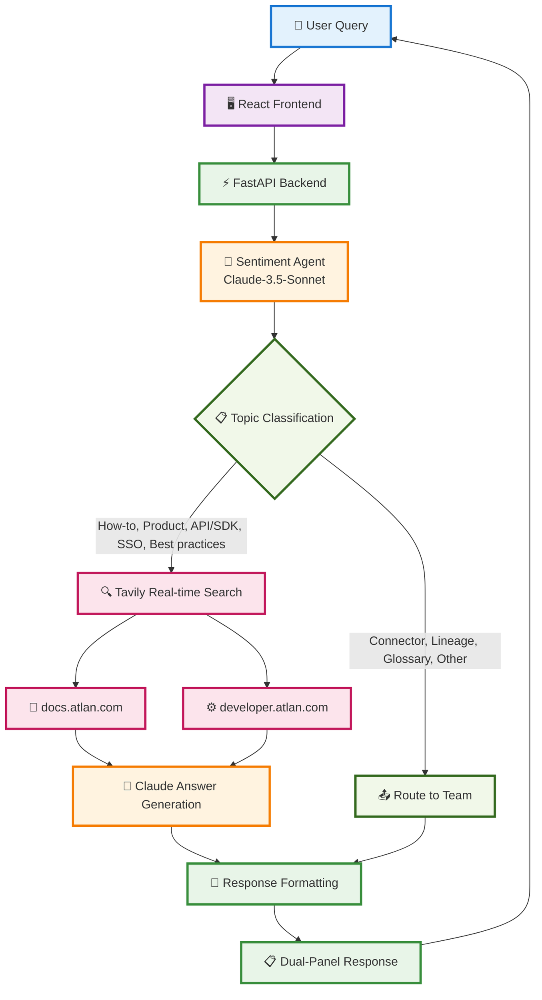

# Simplified Architecture Diagram

## Core System Flow

## Component Responsibilities

### 🖥️ Frontend Layer
- **Interactive Agent UI**: Dual-panel interface for query and response
- **Ticket Dashboard**: Batch processing and statistics
- **Analytics Reports**: Sentiment insights and performance metrics

### ⚡ Backend Layer
- **FastAPI Server**: REST endpoints and async processing
- **CORS Middleware**: Cross-origin request handling
- **Response Formatting**: Clean answer separation from sources

### 🧠 AI Processing
- **Sentiment Agent**: Topic classification, sentiment analysis, priority scoring
- **Tavily System**: Orchestration and routing logic
- **Tavily RAG**: Real-time search and answer generation

### ☁️ External Services
- **Claude API**: Primary LLM for classification and answer generation
- **Tavily API**: Real-time web search and content extraction

### 📚 Knowledge Sources
- **docs.atlan.com**: Product documentation and user guides
- **developer.atlan.com**: API references and SDK documentation

## Data Flow Summary

1. **User Input** → React Frontend
2. **API Request** → FastAPI Backend
3. **Classification** → Sentiment Agent (Claude)
4. **Routing Decision** → Topic-based logic
5. **Search/Route** → Tavily Search OR Team Routing
6. **Answer Generation** → Claude (if Tavily used)
7. **Response Formatting** → Clean separation of content and sources
8. **UI Display** → Dual-panel interface

## Key Features

- ✅ **Smart Routing**: Only specific topics use Tavily search
- ✅ **Real-time Search**: Live documentation search with Tavily
- ✅ **Clean Formatting**: Sources separated from answers
- ✅ **Transparent UI**: Shows internal analysis and final response
- ✅ **Error Handling**: Graceful fallbacks for all failure modes
