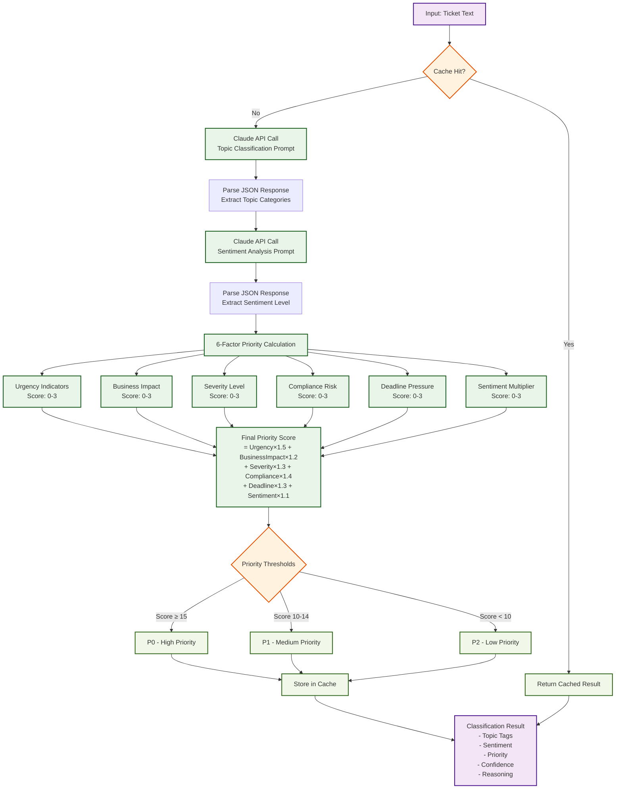
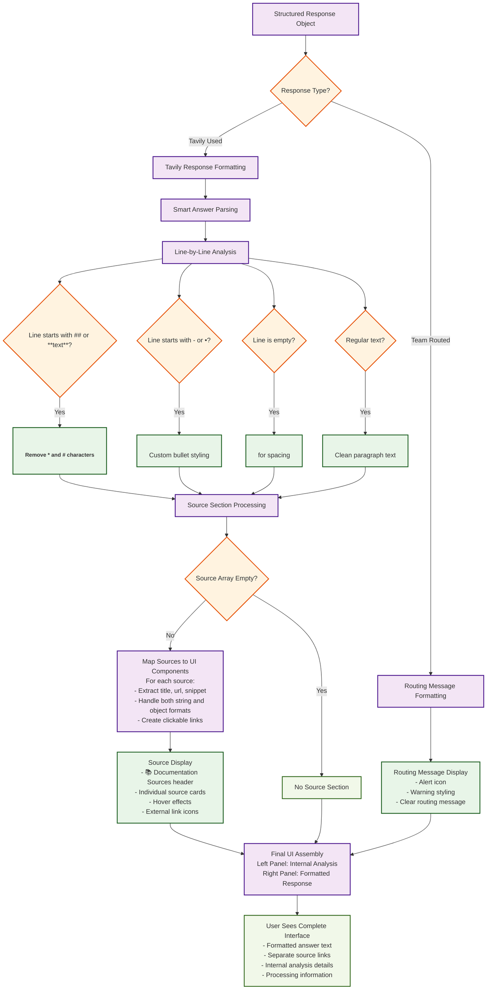

# AI Model Workflow Diagram

## Complete Data Flow & Decision Tree

```mermaid
flowchart TD
    Start([User Input Query]) --> InputValidation{Valid Input?}
    
    InputValidation -->|No| Error1[Return Error Message]
    InputValidation -->|Yes| SentimentAgent[Sentiment Agent Processing]
    
    SentimentAgent --> TopicClassification[Topic Classification<br/>Claude-3.5-Sonnet]
    SentimentAgent --> SentimentAnalysis[Sentiment Analysis<br/>Claude-3.5-Sonnet]
    SentimentAgent --> PriorityScoring[6-Factor Priority Scoring]
    
    TopicClassification --> TopicResult{Topic Categories}
    SentimentAnalysis --> SentimentResult{Sentiment Level}
    PriorityScoring --> PriorityResult{Priority Level}
    
    TopicResult -->|How-to| RouteDecision[Routing Decision Engine]
    TopicResult -->|Product| RouteDecision
    TopicResult -->|Best practices| RouteDecision
    TopicResult -->|API/SDK| RouteDecision
    TopicResult -->|SSO| RouteDecision
    TopicResult -->|Connector| RouteDecision
    TopicResult -->|Lineage| RouteDecision
    TopicResult -->|Glossary| RouteDecision
    TopicResult -->|Sensitive data| RouteDecision
    TopicResult -->|Other| RouteDecision
    
    RouteDecision --> TavilyAllowed{Tavily Allowed Topics?}
    
    TavilyAllowed -->|Yes<br/>How-to, Product, Best practices,<br/>API/SDK, SSO| TavilyProcessing[Tavily Processing Pipeline]
    TavilyAllowed -->|No<br/>Connector, Lineage, Glossary,<br/>Sensitive data, Other| TeamRouting[Team Routing]
    
    TeamRouting --> RoutingMessage[Generate Routing Message<br/>"This ticket has been classified as<br/>'Connector' issue and routed to<br/>the appropriate team."]
    RoutingMessage --> FinalResponse1[Final Response<br/>Type: Routed]
    
    TavilyProcessing --> SiteSelection{Site Selection Logic}
    
    SiteSelection -->|API/SDK Topic| DevHubSearch[Search developer.atlan.com<br/>Site Type: devhub]
    SiteSelection -->|Other Topics| DocsSearch[Search docs.atlan.com<br/>Site Type: docs]
    
    DevHubSearch --> QueryEnhancement1[Query Enhancement<br/>+ "API documentation SDK developer guide"]
    DocsSearch --> QueryEnhancement2[Query Enhancement<br/>+ "product features user guide documentation"]
    
    QueryEnhancement1 --> TavilyAPI[Tavily API Call<br/>Real-time Search]
    QueryEnhancement2 --> TavilyAPI
    
    TavilyAPI --> SearchResults{Search Results Found?}
    
    SearchResults -->|No Results| NoResultsResponse[Return: "I couldn't find current<br/>information about this topic<br/>in the documentation."]
    NoResultsResponse --> FinalResponse2[Final Response<br/>Type: Tavily - No Results]
    
    SearchResults -->|Results Found| SourceExtraction[Source Extraction & Structuring]
    
    SourceExtraction --> SourceObjects[Create Source Objects<br/>- title: Document title<br/>- url: Document URL<br/>- snippet: Content preview 200 chars]
    
    SourceObjects --> AnswerGeneration[Answer Generation<br/>Claude-3.5-Sonnet]
    
    AnswerGeneration --> ClaudePrompt[Claude Prompt Engineering<br/>- Summarize key information<br/>- Synthesize multiple sources<br/>- Structure with clear sections<br/>- DO NOT include source URLs<br/>- Focus on actionable guidance]
    
    ClaudePrompt --> RawAnswer[Raw AI Answer]
    
    RawAnswer --> AnswerCleaning[Answer Cleaning Pipeline]
    
    AnswerCleaning --> RegexClean1[Remove **Sources:** sections]
    RegexClean1 --> RegexClean2[Remove standalone URLs]
    RegexClean2 --> RegexClean3[Remove source-related keywords]
    RegexClean3 --> RegexClean4[Remove Atlan domain URLs]
    RegexClean4 --> CleanAnswer[Clean Answer Text]
    
    CleanAnswer --> ResponseStructuring[Response Structuring]
    
    ResponseStructuring --> StructuredResponse[Structured Response Object<br/>- answer: Clean text only<br/>- sources: Separate array<br/>- confidence: Search relevance score<br/>- is_tavily_used: true]
    
    StructuredResponse --> UIFormatting[UI Formatting & Display]
    
    UIFormatting --> TextParsing[Smart Text Parsing<br/>- Headings: ## or **text**<br/>- Bullets: - or •<br/>- Paragraphs: Clean spacing]
    
    TextParsing --> DualPanel[Dual Panel Interface]
    
    DualPanel --> LeftPanel[Left Panel: Internal Analysis<br/>- Topic Tags<br/>- Sentiment<br/>- Priority<br/>- Confidence Score<br/>- AI Reasoning<br/>- Processing Method]
    
    DualPanel --> RightPanel[Right Panel: Final Response<br/>- Formatted Answer<br/>- Source Links Section<br/>- Processing Info]
    
    LeftPanel --> UserDisplay[User Sees Complete Analysis]
    RightPanel --> UserDisplay
    
    FinalResponse1 --> UserDisplay
    FinalResponse2 --> UserDisplay
    
    Error1 --> UserDisplay
    
    classDef startEnd fill:#e1f5fe,stroke:#01579b,stroke-width:3px
    classDef process fill:#f3e5f5,stroke:#4a148c,stroke-width:2px
    classDef decision fill:#fff3e0,stroke:#e65100,stroke-width:2px
    classDef ai fill:#e8f5e8,stroke:#1b5e20,stroke-width:2px
    classDef external fill:#fce4ec,stroke:#880e4f,stroke-width:2px
    classDef output fill:#f1f8e9,stroke:#33691e,stroke-width:2px
    
    class Start,UserDisplay startEnd
    class SentimentAgent,TopicClassification,SentimentAnalysis,PriorityScoring,RouteDecision,TavilyProcessing,SiteSelection,QueryEnhancement1,QueryEnhancement2,SourceExtraction,SourceObjects,AnswerGeneration,AnswerCleaning,ResponseStructuring,UIFormatting,TextParsing,DualPanel process
    class InputValidation,TopicResult,SentimentResult,PriorityResult,TavilyAllowed,SearchResults decision
    class TopicClassification,SentimentAnalysis,PriorityScoring,ClaudePrompt,RawAnswer,AnswerCleaning ai
    class TavilyAPI,DevHubSearch,DocsSearch external
    class CleanAnswer,StructuredResponse,LeftPanel,RightPanel,FinalResponse1,FinalResponse2,RoutingMessage,NoResultsResponse output
```

## Detailed Component Workflows

### 1. Sentiment Agent Processing Flow



### 2. Tavily RAG Integration Flow

```mermaid
flowchart TD
    TR_Start[Input: Query + Topic Tags] --> PromptOptimization[Prompt Optimization Engine]
    
    PromptOptimization --> TopicCheck{Topic Analysis}
    
    TopicCheck -->|API/SDK| APIPrompt[Enhanced Query:<br/>query + "API documentation SDK developer guide"<br/>Site: developer.atlan.com]
    TopicCheck -->|Product| ProductPrompt[Enhanced Query:<br/>query + "product features user guide documentation"<br/>Site: docs.atlan.com]
    TopicCheck -->|How-to| HowToPrompt[Enhanced Query:<br/>query + "how to tutorial step by step guide"<br/>Site: docs.atlan.com]
    TopicCheck -->|SSO| SSOPrompt[Enhanced Query:<br/>query + "single sign on authentication setup configuration"<br/>Site: docs.atlan.com]
    TopicCheck -->|Best practices| BPPrompt[Enhanced Query:<br/>query + "best practices recommendations guidelines"<br/>Site: docs.atlan.com]
    
    APIPrompt --> TavilyCall[Tavily API Call<br/>- search_depth: advanced<br/>- include_answer: true<br/>- include_raw_content: true<br/>- max_results: 5<br/>- include_domains: site-specific]
    
    ProductPrompt --> TavilyCall
    HowToPrompt --> TavilyCall
    SSOPrompt --> TavilyCall
    BPPrompt --> TavilyCall
    
    TavilyCall --> TavilyResponse[Tavily API Response]
    
    TavilyResponse --> ResultsCheck{Results Found?}
    
    ResultsCheck -->|No| EmptyResponse[Return Empty Response<br/>"I couldn't find current information..."]
    
    ResultsCheck -->|Yes| SourceProcessing[Source Processing]
    
    SourceProcessing --> SourceStruct[Create Structured Sources<br/>For each result:<br/>- title: result.title<br/>- url: result.url<br/>- snippet: result.content[:200]]
    
    SourceStruct --> ContextBuilding[Context Building for Claude]
    
    ContextBuilding --> ClaudeContext[Claude Context:<br/>- Source titles and URLs<br/>- Relevance scores<br/>- Content snippets<br/>- Structured format]
    
    ClaudeContext --> ClaudeAnswer[Claude Answer Generation<br/>Model: claude-3-5-sonnet<br/>Temperature: 0.1<br/>Max Tokens: 1500]
    
    ClaudeAnswer --> RawResponse[Raw Claude Response]
    
    RawResponse --> CleaningPipeline[Answer Cleaning Pipeline]
    
    CleaningPipeline --> Regex1[Remove **Sources:** sections]
    Regex1 --> Regex2[Remove standalone URLs]
    Regex2 --> Regex3[Remove source keywords]
    Regex3 --> Regex4[Remove Atlan domain URLs]
    Regex4 --> CleanText[Clean Answer Text]
    
    CleanText --> ConfidenceCalc[Confidence Calculation<br/>Average of search result scores]
    
    ConfidenceCalc --> TR_Result[Enhanced RAG Response<br/>- answer: Clean text<br/>- sources: Structured array<br/>- confidence: Calculated score<br/>- is_realtime: true]
    
    EmptyResponse --> TR_Result
    
    classDef process fill:#f3e5f5,stroke:#4a148c,stroke-width:2px
    classDef decision fill:#fff3e0,stroke:#e65100,stroke-width:2px
    classDef ai fill:#e8f5e8,stroke:#1b5e20,stroke-width:2px
    classDef external fill:#fce4ec,stroke:#880e4f,stroke-width:2px
    classDef output fill:#f1f8e9,stroke:#33691e,stroke-width:2px
    
    class TR_Start,TR_Result,PromptOptimization,SourceProcessing,SourceStruct,ContextBuilding,CleaningPipeline,ConfidenceCalc process
    class TopicCheck,ResultsCheck decision
    class ClaudeContext,ClaudeAnswer,RawResponse ai
    class TavilyCall,TavilyResponse external
    class APIPrompt,ProductPrompt,HowToPrompt,SSOPrompt,BPPrompt,EmptyResponse,CleanText output
```

### 3. UI Response Formatting Flow



## Decision Points & Business Logic

### Topic-Based Routing Matrix

| Topic | Tavily Allowed | Site Type | Query Enhancement | Routing Action |
|-------|---------------|-----------|------------------|----------------|
| How-to | ✅ Yes | docs.atlan.com | + "how to tutorial step by step guide" | Real-time search |
| Product | ✅ Yes | docs.atlan.com | + "product features user guide documentation" | Real-time search |
| Best practices | ✅ Yes | docs.atlan.com | + "best practices recommendations guidelines" | Real-time search |
| API/SDK | ✅ Yes | developer.atlan.com | + "API documentation SDK developer guide" | Real-time search |
| SSO | ✅ Yes | docs.atlan.com | + "single sign on authentication setup configuration" | Real-time search |
| Connector | ❌ No | N/A | N/A | Route to team |
| Lineage | ❌ No | N/A | N/A | Route to team |
| Glossary | ❌ No | N/A | N/A | Route to team |
| Sensitive data | ❌ No | N/A | N/A | Route to team |
| Other | ❌ No | N/A | N/A | Route to team |

### Priority Scoring Matrix

| Factor | Weight | Score Range | Examples |
|--------|--------|-------------|----------|
| Urgency | 1.5× | 0-3 | "urgent": 3, "important": 2, "help": 1 |
| Business Impact | 1.2× | 0-3 | "revenue": 3, "compliance": 2, "feature": 1 |
| Severity | 1.3× | 0-3 | "critical": 3, "major": 2, "minor": 1 |
| Compliance | 1.4× | 0-3 | "gdpr": 3, "sox": 2, "internal": 1 |
| Deadline | 1.3× | 0-3 | "today": 3, "this week": 2, "soon": 1 |
| Sentiment | 1.1× | 0-3 | "angry": 3, "frustrated": 2, "neutral": 1 |

### Final Priority Thresholds

- **P0 (High)**: Score ≥ 15
- **P1 (Medium)**: Score 10-14  
- **P2 (Low)**: Score < 10

## Error Handling & Fallbacks

```mermaid
flowchart TD
    ErrorStart[Error Detected] --> ErrorType{Error Type?}
    
    ErrorType -->|API Error| APIError[API Error Handling]
    ErrorType -->|Classification Error| ClassError[Classification Error Handling]
    ErrorType -->|Search Error| SearchError[Search Error Handling]
    ErrorType -->|Formatting Error| FormatError[Formatting Error Handling]
    
    APIError --> APIFallback[Fallback Response<br/>- Default classification<br/>- Error message<br/>- Retry mechanism]
    
    ClassError --> ClassFallback[Default Classification<br/>- Topic: "Product"<br/>- Sentiment: "Neutral"<br/>- Priority: "P2 (Low)"]
    
    SearchError --> SearchFallback[Search Fallback<br/>- Return static answer<br/>- Indicate search failure<br/>- Suggest manual review]
    
    FormatError --> FormatFallback[Format Fallback<br/>- Raw text display<br/>- Basic formatting<br/>- Error notification]
    
    APIFallback --> ErrorResponse[Error Response to User]
    ClassFallback --> ErrorResponse
    SearchFallback --> ErrorResponse
    FormatFallback --> ErrorResponse
    
    classDef error fill:#ffebee,stroke:#c62828,stroke-width:2px
    classDef fallback fill:#fff3e0,stroke:#ef6c00,stroke-width:2px
    classDef response fill:#f1f8e9,stroke:#33691e,stroke-width:2px
    
    class ErrorStart,ErrorType error
    class APIError,ClassError,SearchError,FormatError,APIFallback,ClassFallback,SearchFallback,FormatFallback fallback
    class ErrorResponse response
```

This comprehensive workflow diagram shows every decision point, data transformation, and business logic rule in the AI pipeline, providing a complete technical reference for understanding and maintaining the system.
