# Atlan Customer Copilot

An AI-powered customer support system that intelligently classifies tickets, analyzes sentiment, and provides real-time documentation search to deliver comprehensive support responses for Atlan customers.

## 🎯 Project Vision & Journey

This project evolved from a simple ticket classification system into a sophisticated AI-powered customer support copilot. The development journey involved multiple iterations, each addressing specific challenges in customer support automation while maintaining the delicate balance between automation and human touch.

### Evolution Timeline

1. **Phase 1**: Basic ticket classification with sentiment analysis
2. **Phase 2**: Added Tavily, which retrieves the most relevant, high-quality web snippets using semantic embeddings and ranking signals, then feeds them into an LLM for grounded, context-rich answers.
3. **Phase 3**: Real-time search integration using Tavily API on the web links given
4. **Phase 4**: Strict routing logic and UI optimization
5. **Phase 5**: Prompt-based search optimization and clean formatting

## 🏗️ System Architecture

> **📋 Detailed Model Workflow**: For a comprehensive view of the AI pipeline data flow, decision points, and business logic, see [MODEL_WORKFLOW.md](MODEL_WORKFLOW.md)

```mermaid
graph TB
    subgraph "🎨 Frontend Layer"
        UI["🖥️ Interactive Agent UI<br/>React + TypeScript<br/>Dual-Panel Interface"]
        Dashboard["📊 Ticket Dashboard<br/>Batch Processing<br/>Statistics Overview"]
        Reports["📈 Sentiment Reports<br/>Analytics & Insights<br/>Performance Metrics"]
    end
    
    subgraph "🔌 API Gateway Layer"
        FastAPI["⚡ FastAPI Backend<br/>REST Endpoints<br/>Async Processing"]
        CORS["🌐 CORS Middleware<br/>Cross-Origin Handling<br/>Security Headers"]
    end
    
    subgraph "🧠 AI Processing Pipeline"
        SentimentAgent["🎯 Sentiment Agent<br/>Claude-3.5-Sonnet<br/>• Topic Classification<br/>• Sentiment Analysis<br/>• Priority Scoring"]
        TavilySystem["🔄 Simple Tavily System<br/>Orchestration Layer<br/>• Routing Logic<br/>• Response Coordination<br/>• Error Handling"]
        TavilyRAG["🔍 Tavily RAG Integration<br/>Real-time Search Engine<br/>• Web Search & Extraction<br/>• Answer Generation<br/>• Source Structuring"]
    end
    
    subgraph "☁️ External AI Services"
        Claude["🤖 Anthropic Claude API<br/>Primary LLM<br/>• Classification<br/>• Answer Generation<br/>• Content Synthesis"]
        Tavily["🌍 Tavily Search API<br/>Web Search & Extraction<br/>• Real-time Content<br/>• Relevance Scoring<br/>• Site Targeting"]
    end
    
    subgraph "📚 Knowledge Sources"
        DocsSite["📖 docs.atlan.com<br/>Product Documentation<br/>• User Guides<br/>• Feature Docs<br/>• Best Practices"]
        DevHub["⚙️ developer.atlan.com<br/>API & SDK References<br/>• API Endpoints<br/>• SDK Methods<br/>• Integration Guides"]
    end
    
    subgraph "💾 Data Layer"
        ChromaDB["🗃️ ChromaDB<br/>Vector Storage<br/>• Embeddings<br/>• Semantic Search<br/>• Cached Results"]
        SampleData["📄 Sample Tickets<br/>JSON Test Data<br/>• Classification Examples<br/>• Testing Scenarios<br/>• Performance Benchmarks"]
    end
    
    %% User Interactions
    UI -.->|"User Query"| FastAPI
    Dashboard -.->|"Batch Processing"| FastAPI
    Reports -.->|"Analytics Request"| FastAPI
    
    %% API Layer Connections
    FastAPI -->|"Process Request"| SentimentAgent
    FastAPI -->|"Route Request"| TavilySystem
    CORS -->|"Enable CORS"| FastAPI
    
    %% AI Pipeline Connections
    SentimentAgent -->|"Classification Request"| Claude
    TavilySystem -->|"Search Request"| TavilyRAG
    TavilySystem -->|"Analysis Request"| SentimentAgent
    
    %% External Service Connections
    TavilyRAG -->|"Search Query"| Tavily
    TavilyRAG -->|"Answer Generation"| Claude
    
    %% Knowledge Source Connections
    Tavily -->|"Search docs.atlan.com"| DocsSite
    Tavily -->|"Search developer.atlan.com"| DevHub
    
    %% Data Layer Connections
    SentimentAgent -.->|"Cache Results"| ChromaDB
    TavilySystem -.->|"Load Test Data"| SampleData
    
    %% Response Flow
    TavilyRAG -.->|"Structured Response"| TavilySystem
    TavilySystem -.->|"Final Response"| FastAPI
    FastAPI -.->|"JSON Response"| UI
    
    %% Styling
    classDef frontend fill:#e3f2fd,stroke:#1976d2,stroke-width:3px,color:#000
    classDef backend fill:#f3e5f5,stroke:#7b1fa2,stroke-width:3px,color:#000
    classDef ai fill:#e8f5e8,stroke:#388e3c,stroke-width:3px,color:#000
    classDef external fill:#fff3e0,stroke:#f57c00,stroke-width:3px,color:#000
    classDef knowledge fill:#fce4ec,stroke:#c2185b,stroke-width:3px,color:#000
    classDef storage fill:#f1f8e9,stroke:#33691e,stroke-width:3px,color:#000
    
    class UI,Dashboard,Reports frontend
    class FastAPI,CORS backend
    class SentimentAgent,TavilySystem,TavilyRAG ai
    class Claude,Tavily external
    class DocsSite,DevHub knowledge
    class ChromaDB,SampleData storage
```



## 🔧 Major Design Decisions & Trade-offs

### 1. **LLM Selection: Anthropic Claude vs Alternatives**

**Decision**: Choose Claude-3.5-Sonnet as the primary LLM

**Detailed Analysis**:
- **vs OpenAI GPT-4**: Claude provides better instruction following and structured output formatting
- **vs Open Source Models**: Higher accuracy and reliability for production use
- **vs Smaller Models**: Better reasoning capabilities for complex classification tasks

**Trade-offs**:
- ✅ **Pros**: Superior accuracy (95%+ classification accuracy), excellent prompt adherence, robust API
- ❌ **Cons**: Higher cost (~$0.003 per request), proprietary model
- **Rationale**: Customer support quality is critical - accuracy over cost optimization

**Implementation Details**:
```python
# Optimized Claude configuration
self.llm_client = Anthropic(api_key=claude_api_key)
self.model = "claude-3-5-sonnet-20241022"  # Latest model for best performance
self.temperature = 0.1  # Low temperature for consistent classification
self.max_tokens = 1000  # Sufficient for detailed responses
```

### 2. **Search Strategy:  Pure Real-time tavily based retrieval vs Rag based Static Only**

**Decision**: Implement hybrid approach combining static RAG (ChromaDB) with real-time search (Tavily)

**Journey Evolution**:
1. **Started with**: Static RAG using ChromaDB for documentation embedding
2. **Identified Issue**: Outdated information and limited coverage
3. **Experimented with**: Pure real-time search for every query with detailed relevant solutions along with source links
4. **Discovered Problem**: High costs and inconsistent results
5. **Final Solution**: Used Talivy based real time retreival from web along with Smart routing based on topic classification using a semantic agent 

**Trade-offs**:
- ✅ **Pros**: Best of both worlds - fast cached responses + up-to-date information
- ❌ **Cons**: Increased system complexity, multiple API dependencies
- **Rationale**: Customer support needs both speed and accuracy

**Implementation Strategy**:
```python
# Strict routing logic implemented
tavily_allowed_topics = {"How-to", "Product", "Best practices", "API/SDK", "SSO"}
should_use_tavily = any(tag in tavily_allowed_topics for tag in topic_tags)

if should_use_tavily:
    # Use real-time search for specific topics
    search_results = await tavily.search_documentation(query, site_type)
else:
    # Route to human team for other topics
    return routing_message
```

### 3. **Real-time Search Provider: Tavily vs Alternatives**

**Decision**: Choose Tavily API for real-time documentation search

**Detailed Comparison**:
- **vs Google Custom Search**: Tavily provides better content extraction and relevance scoring
- **vs SerpAPI**: Tavily offers structured results with content snippets
- **vs Web scraping**: Tavily handles anti-bot measures and provides clean content

**Trade-offs**:
- ✅ **Pros**: High-quality content extraction, relevance scoring, built-in filtering
- ❌ **Cons**: Additional API cost, dependency on external service
- **Rationale**: Quality of search results directly impacts answer accuracy

**Optimization Implementation**:
```python
# Site-specific search optimization
def get_optimized_search_prompt(self, query: str, topic_tags: List[str]) -> Tuple[str, str]:
    if "API/SDK" in topic_tags:
        site_type = "devhub"  # Focus on developer.atlan.com
        enhanced_query = f"{query} API documentation SDK developer guide"
    else:
        site_type = "docs"    # Focus on docs.atlan.com
        enhanced_query = f"{query} product features user guide documentation"
    
    return enhanced_query, site_type
```

### 4. **Classification System: Multi-factor vs Simple Keyword Matching**

**Decision**: Implement sophisticated 6-factor priority scoring system

**Factor Analysis**:
```python
# 6-Factor Priority Scoring Formula
# Final Priority Score = Urgency×1.5 + BusinessImpact×1.2 + Severity×1.3 + 
#                       Compliance×1.4 + Deadline×1.3 + Sentiment×1.1

urgency_indicators = {
    'urgent': 3, 'critical failure': 3, 'emergency': 3, 'asap': 3,
    'blocked': 3, 'deadline approaching': 3, 'down': 3, 'broken': 3
}
```

**Trade-offs**:
- ✅ **Pros**: More nuanced prioritization, considers business impact, handles edge cases
- ❌ **Cons**: Complex implementation, requires fine-tuning, more computation
- **Rationale**: Better prioritization leads to improved customer satisfaction and resource allocation

### 5. **UI Design: Dual-Panel vs Single Response Interface**

**Decision**: Implement dual-panel interface showing internal analysis and final response

**Design Philosophy**:
- **Transparency**: Users can see how the system classified their query
- **Trust**: Internal analysis builds confidence in the AI decisions
- **Debugging**: Support agents can understand the reasoning behind responses

**Trade-offs**:
- ✅ **Pros**: Increased transparency, better user trust, easier debugging
- ❌ **Cons**: More complex UI, potential information overload
- **Rationale**: Transparency is crucial for AI systems in customer support

### 6. **Response Formatting: Clean Separation vs Integrated Sources**

**Decision**: Completely separate source links from answer content

**Journey**:
1. **Initial Problem**: Sources were mixed with answers, creating messy output
2. **Attempted Fix**: Basic regex cleaning
3. **Persistent Issue**: AI still included source references
4. **Final Solution**: Aggressive prompt engineering + comprehensive cleaning

**Implementation**:
```python
# Aggressive source cleaning
answer = re.sub(r'\*\*Sources?:\*\*\s*\n.*', '', answer, flags=re.MULTILINE | re.DOTALL)
answer = re.sub(r'https?://(developer|docs)\.atlan\.com[^\s]*', '', answer)
answer = re.sub(r'\n\s*(Sources?|Links?|References?):\s*\n.*', '', answer, flags=re.MULTILINE | re.DOTALL)
```

## 🛠️ Technology Stack Deep Dive

### Backend Architecture

**FastAPI Choice Rationale**:
- **Performance**: Async support for handling multiple concurrent requests
- **Documentation**: Auto-generated OpenAPI docs at `/docs`
- **Type Safety**: Built-in Pydantic validation
- **Development**: Hot reload for rapid iteration

**Key Implementation**:
```python
@app.post("/api/interactive-agent")
async def process_interactive_ticket(ticket: TicketInput):
    # Async processing for better performance
    tavily_response = await simple_tavily_system.process_ticket(ticket.text)
    analysis = await simple_tavily_system.analyze_ticket(ticket.text)
    
    return {
        "internal_analysis": internal_analysis,
        "final_response": final_response_data,
        "processing_method": "tavily" if tavily_response.is_tavily_used else "routed"
    }
```

### Frontend Architecture

**React + TypeScript Choice**:
- **Type Safety**: TypeScript prevents runtime errors
- **Component Reusability**: Modular UI components
- **State Management**: Built-in hooks for complex state
- **Developer Experience**: Excellent tooling and debugging

**Key Components**:
```typescript
// Dual-panel interface for transparency
const DualPanelAgent: React.FC = () => {
  const [response, setResponse] = useState<AgentResponse | null>(null);
  
  return (
    <div className="dual-panel-results">
      <div className="panel left-panel">
        {/* Internal Analysis */}
        <InternalAnalysisView analysis={response.internal_analysis} />
      </div>
      <div className="panel right-panel">
        {/* Final Response */}
        <FinalResponseView response={response.final_response} />
      </div>
    </div>
  );
};
```

### AI Pipeline Architecture

**Modular Design Philosophy**:
- **Separation of Concerns**: Each component has a single responsibility
- **Loose Coupling**: Components communicate through well-defined interfaces
- **Extensibility**: Easy to add new classification categories or search providers

**Core Components**:

1. **Sentiment Agent** (`sentiment_agent.py`):
   - Handles topic classification, sentiment analysis, and priority assignment
   - Implements caching for improved performance
   - Uses structured prompts for consistent output


2. **Real time interaction with knowledge databse using Tavily System** (`simple_tavily_system.py`):
   - Orchestrates the entire processing pipeline
   - Implements strict routing logic
   - Coordinates between classification and search

## 🚀 Quick Start

### Option 1: Automated Setup (Recommended)

**For macOS/Linux:**
```bash
git clone <repository-url>
cd ATLAN_CUSTOMER_COPILOT
chmod +x quick_setup.sh
./quick_setup.sh
```

**For Windows:**
```cmd
git clone <repository-url>
cd ATLAN_CUSTOMER_COPILOT
quick_setup.bat
```

### Option 2: Manual Setup

**📋 Prerequisites:**
- **Python 3.8+**: Required for async/await support and modern Python features
- **Node.js 16+**: Required for React frontend development
- **API Keys**: Claude API key and Tavily API key

**🔧 Step-by-Step Setup:**

1. **Clone and Setup**
   ```bash
   git clone <repository-url>
   cd ATLAN_CUSTOMER_COPILOT
   
   # Create and activate virtual environment
   python3 -m venv venv
   source venv/bin/activate  # On Windows: venv\Scripts\activate
   
   # Install Python dependencies
   pip install -r requirements.txt
   ```

2. **Environment Configuration**
   ```bash
   # Copy environment template
   cp env.example .env
   
   # Edit .env with your API keys
   nano .env  # or your preferred editor
   ```

   **Required Environment Variables**:
   ```env
   # Anthropic Claude API (Primary LLM)
   CLAUDE_API_KEY=your_claude_api_key_here
   CLAUDE_MODEL=claude-3-5-sonnet-20241022
   CLAUDE_TEMPERATURE=0.1
   CLAUDE_MAX_TOKENS=1000
   
   # Tavily Search API (Real-time search)
   TAVILY_API_KEY=your_tavily_api_key_here
   ```

3. **Frontend Setup**
   ```bash
   cd client
   npm install
   cd ..
   ```

**🚀 Running the Application:**

1. **Start Backend Server**
   ```bash
   # From project root with virtual environment activated
   source venv/bin/activate
   python3 main.py
   ```

2. **Start Frontend Development Server**
   ```bash
   # In a new terminal
   cd client
   npm start
   ```

3. **Access the Application**
   - **Frontend**: http://localhost:3000
   - **Backend API**: http://localhost:8000
   - **API Documentation**: http://localhost:8000/docs

**📖 Detailed Setup Instructions:**
For comprehensive setup instructions, troubleshooting, and advanced configuration, see [SETUP_INSTRUCTIONS.md](SETUP_INSTRUCTIONS.md).

## 📊 Performance & Optimization

### Caching Strategy
```python
# Sentiment Agent implements response caching
self._cache = {}
self._cache_max_size = 1000

def _get_cached_response(self, query: str) -> Optional[str]:
    cache_key = hashlib.md5(query.encode()).hexdigest()
    return self._cache.get(cache_key)
```

### Async Processing
```python
# All I/O operations are asynchronous
async def process_ticket(self, ticket_text: str) -> TavilyResponse:
    # Concurrent processing for better performance
    analysis = await self.analyze_ticket(ticket_text)
    search_results = await tavily.search_documentation(ticket_text, site_type)
    answer = await tavily.generate_realtime_answer(ticket_text, search_results)
```

### Rate Limiting
```python
# Built-in delays to respect API rate limits
await asyncio.sleep(0.5)  # Small delay between Tavily requests
```

## 🔒 Security Considerations

- **API Key Management**: Environment variables for sensitive credentials
- **Input Validation**: Pydantic models validate all inputs
- **CORS Configuration**: Properly configured for frontend access
- **No Sensitive Logging**: API keys are never logged

## 🧪 Testing & Quality Assurance

### Backend Testing
```bash
# Test the classification system
python -c "
import asyncio
from ai_pipeline.simple_tavily_system import get_simple_tavily_system

async def test_classification():
    system = await get_simple_tavily_system()
    response = await system.process_ticket('How do I connect to Snowflake?')
    print(f'Topic: {response.internal_analysis.topic_tags}')
    print(f'Uses Tavily: {response.final_response.is_tavily_used}')

asyncio.run(test_classification())
"
```

### Frontend Testing
```bash
cd client
npm test
```

## 📈 Monitoring & Analytics

### Built-in Metrics
- **Classification Accuracy**: Track topic classification correctness
- **Response Time**: Monitor API response times
- **Tavily Usage**: Track when real-time search is used vs routing
- **Confidence Scores**: Monitor AI confidence levels

### Logging Strategy
```python
# Structured logging for monitoring
print(f"🔍 Using Tavily for topics: {tavily_topics}")
print(f"🚫 Routing to team for topic: {primary_topic} (Tavily not used per strict rule)")
print(f"✅ Found {len(results)} results from {site_config['description']}")
```

## 🔮 Future Enhancements

### Planned Improvements
1. **Multi-language Support**: Extend to support multiple languages
2. **Custom Model Fine-tuning**: Train models on Atlan-specific data
3. **Integration APIs**: Connect with Zendesk, Jira, Slack
4. **Advanced Analytics**: Detailed performance dashboards
5. **Voice Interface**: Add voice input/output capabilities

### Architecture Evolution
- **Microservices**: Split into smaller, independent services
- **Event-driven**: Implement event sourcing for better scalability
- **Multi-tenant**: Support multiple organizations
- **Edge Deployment**: Deploy closer to users for lower latency

## 🤝 Contributing

### Development Workflow
1. Fork the repository
2. Create a feature branch: `git checkout -b feature/amazing-feature`
3. Make your changes with proper testing
4. Commit with descriptive messages
5. Push to your fork and create a Pull Request

### Code Standards
- **Python**: Follow PEP 8, use type hints
- **TypeScript**: Use strict mode, proper interfaces
- **Testing**: Maintain >80% test coverage
- **Documentation**: Update README for significant changes

## 📄 License


## 🆘 Support & Troubleshooting

### Common Issues

1. **"uvicorn: command not found"**
   ```bash
   # Make sure virtual environment is activated
   source venv/bin/activate
   pip install uvicorn[standard]
   ```

2. **"Address already in use"**
   ```bash
   # Kill existing process
   pkill -f "uvicorn main:app"
   # Or use different port
   uvicorn main:app --port 8001
   ```

3. **API Key Issues**
   - Verify API keys are correctly set in `.env`
   - Check API key permissions and quotas
   - Ensure no extra spaces in environment variables

### Getting Help
- Check existing issues in the repository
- Create a new issue with detailed description
- Include logs, environment details, and steps to reproduce

---

